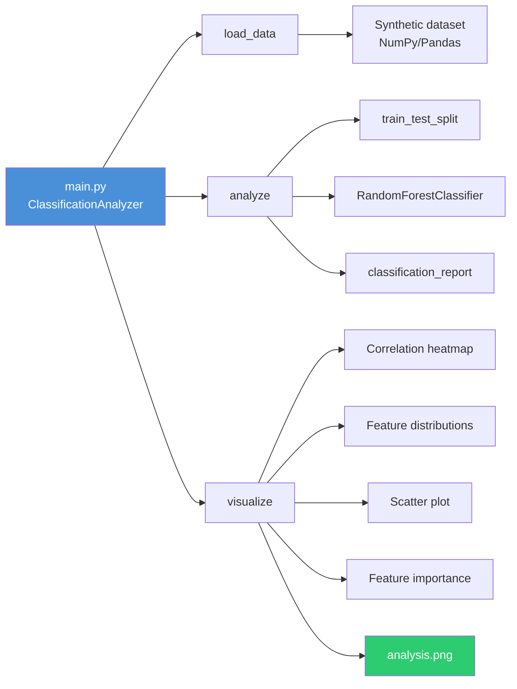

# Deep-Learning-Neural-Networks

Pipeline de classificacao com Random Forest, EDA automatizada e visualizacoes.

> **Nota:** Apesar do nome do repositorio, este projeto **nao** utiliza deep learning nem redes neurais. Ele demonstra um pipeline de classificacao com `RandomForestClassifier` do scikit-learn, geracao de dados sinteticos e visualizacoes EDA com matplotlib/seaborn.

[](https://python.org)
[](https://scikit-learn.org)
[](LICENSE)

[Portugues](#portugues) | [English](#english)

---

## Portugues

### Visao Geral

Projeto educacional que implementa um pipeline completo de classificacao binaria:

1. **Geracao de dados sinteticos** — 1000 amostras com 3 features correlacionadas ao target
2. **Treinamento** — `RandomForestClassifier` com 100 estimadores
3. **Avaliacao** — Accuracy, precision, recall, F1-score via `classification_report`
4. **Visualizacao** — Heatmap de correlacao, distribuicao de features, scatter plot e importancia de features

### Arquitetura


### Como Executar

```bash
# Clonar repositorio
git clone https://github.com/galafis/Deep-Learning-Neural-Networks.git
cd Deep-Learning-Neural-Networks

# Criar ambiente virtual
python -m venv venv
source venv/bin/activate  # Windows: venv\Scripts\activate

# Instalar dependencias
pip install -r requirements.txt

# Executar pipeline
python main.py

# Executar testes
pytest tests/ -v
```

### Saida

O script gera:
- Metricas de classificacao no terminal (accuracy, precision, recall, F1)
- Arquivo `analysis.png` com 4 graficos EDA

### Estrutura do Projeto

```
Deep-Learning-Neural-Networks/
├── main.py              # Pipeline completo (ClassificationAnalyzer)
├── requirements.txt     # Dependencias Python
├── tests/
│   ├── __init__.py
│   └── test_main.py     # 16 testes funcionais
├── LICENSE
└── README.md
```

### Stack Tecnologica

| Tecnologia | Uso |
|------------|-----|
| Python 3.10+ | Linguagem principal |
| scikit-learn | RandomForestClassifier, metricas |
| pandas | Manipulacao de dados |
| NumPy | Geracao de dados sinteticos |
| matplotlib | Graficos e visualizacoes |
| seaborn | Heatmap, scatter plot |
| pytest | Testes funcionais |

### Autor

**Gabriel Demetrios Lafis**
- GitHub: [@galafis](https://github.com/galafis)
- LinkedIn: [Gabriel Demetrios Lafis](https://linkedin.com/in/gabriel-demetrios-lafis)

### Licenca

Licenciado sob a Licenca MIT - veja [LICENSE](LICENSE).

---

## English

### Overview

Educational project implementing a complete binary classification pipeline:

1. **Synthetic data generation** — 1,000 samples with 3 features correlated to the target
2. **Training** — `RandomForestClassifier` with 100 estimators
3. **Evaluation** — Accuracy, precision, recall, F1-score via `classification_report`
4. **Visualization** — Correlation heatmap, feature distributions, scatter plot, and feature importance

> **Note:** Despite the repository name, this project does **not** use deep learning or neural networks. It demonstrates a classification pipeline using scikit-learn's `RandomForestClassifier`.

### Architecture



### Quick Start

```bash
git clone https://github.com/galafis/Deep-Learning-Neural-Networks.git
cd Deep-Learning-Neural-Networks
python -m venv venv
source venv/bin/activate
pip install -r requirements.txt
python main.py
pytest tests/ -v
```

### Output

The script produces:
- Classification metrics printed to terminal (accuracy, precision, recall, F1)
- `analysis.png` file with 4 EDA charts

### Project Structure

```
Deep-Learning-Neural-Networks/
├── main.py              # Full pipeline (ClassificationAnalyzer)
├── requirements.txt     # Python dependencies
├── tests/
│   ├── __init__.py
│   └── test_main.py     # 16 functional tests
├── LICENSE
└── README.md
```

### Tech Stack

| Technology | Usage |
|------------|-------|
| Python 3.10+ | Primary language |
| scikit-learn | RandomForestClassifier, metrics |
| pandas | Data manipulation |
| NumPy | Synthetic data generation |
| matplotlib | Charts and visualization |
| seaborn | Heatmap, scatter plot |
| pytest | Functional tests |

### Author

**Gabriel Demetrios Lafis**
- GitHub: [@galafis](https://github.com/galafis)
- LinkedIn: [Gabriel Demetrios Lafis](https://linkedin.com/in/gabriel-demetrios-lafis)

### License

Licensed under the MIT License - see [LICENSE](LICENSE).
